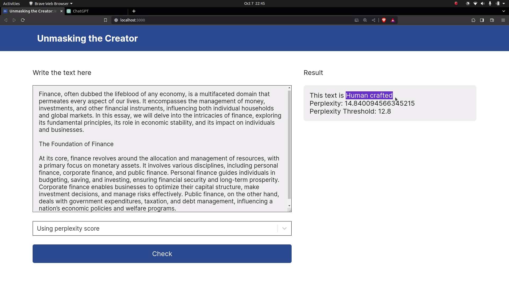

# Creator Unmasker: Identifying AI-generated and Human-written Texts

This machine learning based project involves automatic classification of AI-generated and Human-crafted texts, and was developed using Python language.

### Website interface



This project aims to explore and develop innovative techniques for identifying AI-generated text with a significant level of accuracy. The outcome of this project is expected to contribute to the field of AI ethics and security by providing an effective solution for identifying AI-generated text and image, thereby promoting trust, transparency, and accountability in online content.

### Demo Video for Text Classification

https://github.com/dipudl/creator-unmasker/assets/61581457/356d7211-f653-439f-b06f-91c4b94b39d9

AI generated text detection has become an increasingly important field of research due to the sudden increment of machine-generated text across various platforms. With the advent of advanced language models like GPT-4, generating highly realistic and human-like content has become a reality. However, this progress has also led to concerns regarding the misuse of AI-generated content for malicious purposes, such as spreading fake news, misinformation, and spam. Therefore, the development of effective methods for detecting AI-generated content has become highly important in order to mitigate the potential risks associated with its misuse.

## Datasets Insights

* ### HC3-English dataset
    * Human-written texts - 24,300
    * AI-generated texts - 24,300

* ### GPT Wiki Intro dataset
    * Human-written texts - 150,000
    * AI-generated texts - 150,000

---

## Methodology

The classification of text as AI-generated or human-crafted is based on 3 different methods:

### Direct Text Classification using RoBERTa

This method uses RoBERTa model which can directly classify whether the given text is written by an AI or a human. The model is fine-tuned with our above mentioned datasets.

### Classification using Perplexity Method

This method uses GPT-2 model to calculate perplexity of the given text. The calculated perplexity of the text is compared with the threshold value which is calculated from our dataset. The text having perplexity score lower than the threshold value is classified as AI-generated whereas the text is written by human if its perplexity is higher than the set threshold.

### Domain-wise Perplexity Score Method

The primary concept of this method is the same as the above method except that this method uses different thresholds for different texts based on the domain of the text. Thus, this method first classifies the given text into its respective domain using a fine-tuned RoBERTa model. The domains are based on the above mentioned datasets and the datasets are divided into 6 different domains: HC3 Reddit Eli5, HC3 Open QA, HC3 Medicine, HC3 Finance, HC3 Wiki CSAI and GPT-Wiki-Intro. After identifying the domain of the text, the perplexity of the given text is compared with the mean perplexity threshold of the respective domain. Finally, the text is classified as AI-generated or Human-crafted.

---

## Getting Started

These instructions will get you a copy of the project up and running on your local machine for development and testing purposes.

### Prerequisites

What things you need to install for running this application

```
Python
Python package manager (pip)
Node.js package manager (npm)
```

### Installing & getting started

Clone this project and open with Visual Studio Code(preferred) or any text editor

```
git clone https://github.com/dipudl/creator-unmasker.git
```

Install the required Python dependencies
Installing 'torch' for GPU usage can be tricky so you need see its documentation properly.

```
pip install transformers fastapi "uvicorn[standard]" pydantic torch
```

Go to 'backend' folder and start the Python server using uvicorn (default port is 8000).

```
uvicorn main:app --reload
```

Go to 'frontend' folder and install all required Node.js dependencies
(using npm package manager for example)

```
npm i
```

Start React.js frontend application

```
npm start
```

The machine learning models used in this program need powerful computational resources so GPU is preferred. Anyways, you can test if it runs properly in your computer.

## Built With

* [Python](https://www.python.org/) - For data extraction and machine learning program
* [React.js](https://react.dev/) - Frontend web development library
* [FastAPI](https://fastapi.tiangolo.com/) - Serverside framework for building API

## Contributing

All the helpful pull requests will be accepted.

## License

This project is licensed under the MIT License - see the [LICENSE](LICENSE) file for details